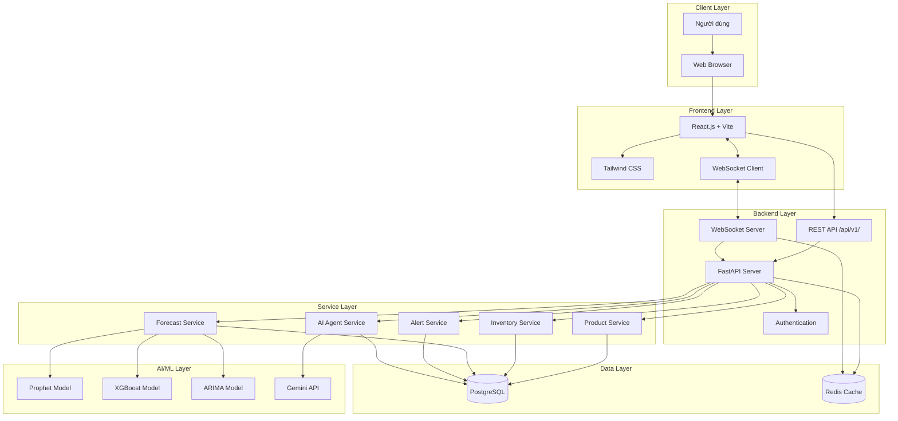
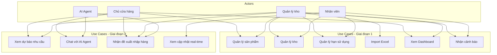
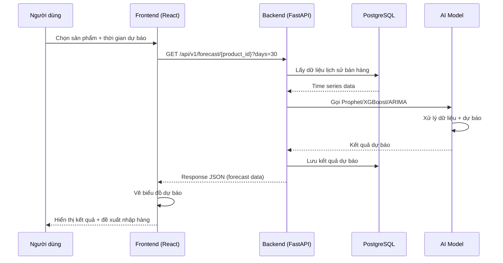
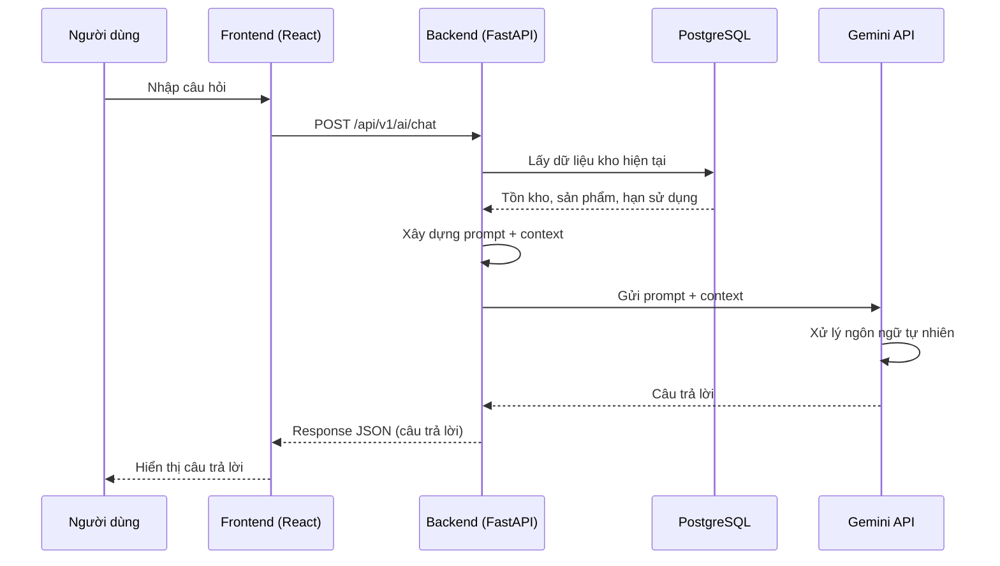

# Sơ đồ Kiến trúc Hệ thống

## 1. Sơ đồ kiến trúc tổng thể

### Giải thích luồng dữ liệu

1. **Người dùng** truy cập ứng dụng qua **Web Browser**
2. **Frontend (React)** giao tiếp với **Backend (FastAPI)** qua 2 kênh:
   - **REST API** (`/api/v1/`) cho các thao tác CRUD
   - **WebSocket** cho dữ liệu real-time (cảnh báo, cập nhật tồn kho)
3. **Backend** xử lý logic nghiệp vụ qua các **Service** layer
4. **Service** layer truy vấn **PostgreSQL** (qua ORM) và gọi **AI Model** khi cần
5. **AI Model** (Prophet, XGBoost, ARIMA) dự báo nhu cầu
6. **Gemini API** cung cấp khả năng chat thông minh cho AI Agent

---

## 2. Sơ đồ Use Case

### Mô tả Use Case

| Use Case | Actor | Mô tả |
|----------|-------|-------|
| Quản lý sản phẩm | Owner, Manager | Thêm/sửa/xóa/thay đổi thông tin sản phẩm |
| Quản lý kho | Manager, Staff | Nhập/xuất hàng, kiểm tra tồn kho |
| Quản lý hạn sử dụng | Manager, Staff | Theo dõi hạn sử dụng, cảnh báo hết hạn |
| Import Excel | Manager | Nhập dữ liệu hàng loạt từ file Excel |
| Xem Dashboard | Owner, Manager | Xem thống kê tồn kho, doanh thu, lãng phí |
| Nhận cảnh báo | Manager, Staff | Nhận thông báo hàng sắp hết hạn, tồn kho bất thường |
| Xem dự báo nhu cầu | Owner, Manager | Xem dự báo bán hàng 7/14/30 ngày |
| Chat với AI Agent | Owner | Hỏi đáp về tình trạng kho, đề xuất nhập hàng |
| Nhận đề xuất nhập hàng | Owner, Manager | Xem gợi ý số lượng nhập hàng tối ưu |
| Xem cập nhật real-time | Staff | Xem cập nhật tồn kho, cảnh báo theo thời gian thực |

---

## 3. Sơ đồ Sequence — Luồng dự báo nhu cầu

### Luồng chi tiết

1. **Người dùng** chọn sản phẩm và khoảng thời gian cần dự báo trên giao diện
2. **Frontend** gửi request `GET /api/v1/forecast/{product_id}?days=30` đến Backend
3. **Backend** truy vấn **PostgreSQL** để lấy dữ liệu lịch sử bán hàng của sản phẩm
4. **Backend** gọi **AI Model** (Prophet/XGBoost/ARIMA) với dữ liệu time series
5. **AI Model** xử lý và trả về kết quả dự báo
6. **Backend** lưu kết quả vào DB và trả response JSON cho Frontend
7. **Frontend** vẽ biểu đồ dự báo và hiển thị đề xuất nhập hàng

---

## 4. Sơ đồ Sequence — Luồng AI Agent chatbot

---

## 5. Mô tả các module

| Module | Công nghệ | Chức năng |
|--------|-----------|-----------|
| **Frontend** | React + Vite + Tailwind CSS | Giao diện người dùng, tương tác, hiển thị dữ liệu |
| **Backend API** | Python FastAPI | Xử lý request, authentication, routing |
| **Product Service** | Python | CRUD sản phẩm, phân loại, tìm kiếm |
| **Inventory Service** | Python | Quản lý tồn kho, nhập/xuất hàng |
| **Forecast Service** | Python | Gọi AI model, xử lý dự báo |
| **Alert Service** | Python | Phát hiện và gửi cảnh báo |
| **AI Agent Service** | Python + Gemini API | Chatbot hỏi đáp, đề xuất nhập hàng |
| **WebSocket Server** | Python | Real-time cập nhật tồn kho, cảnh báo |
| **Database** | PostgreSQL | Lưu trữ dữ liệu sản phẩm, kho, đơn hàng, dự báo |
| **AI Models** | Prophet, XGBoost, ARIMA | Dự báo nhu cầu bán hàng |
| **Gemini API** | Google AI | Xử lý ngôn ngữ tự nhiên cho chatbot |

---

## 6. API Endpoints (dự kiến)

| Method | Endpoint | Mô tả |
|--------|----------|-------|
| GET | `/api/v1/products` | Lấy danh sách sản phẩm |
| POST | `/api/v1/products` | Thêm sản phẩm mới |
| GET | `/api/v1/products/{id}` | Lấy chi tiết sản phẩm |
| PUT | `/api/v1/products/{id}` | Cập nhật sản phẩm |
| DELETE | `/api/v1/products/{id}` | Xóa sản phẩm |
| GET | `/api/v1/inventory` | Lấy tồn kho |
| POST | `/api/v1/inventory/import` | Nhập hàng |
| POST | `/api/v1/inventory/export` | Xuất hàng |
| GET | `/api/v1/dashboard` | Lấy dữ liệu dashboard |
| GET | `/api/v1/alerts` | Lấy danh sách cảnh báo |
| GET | `/api/v1/forecast/{product_id}` | Dự báo nhu cầu |
| POST | `/api/v1/ai/chat` | Chat với AI Agent |
| GET | `/api/v1/recommendations` | Đề xuất nhập hàng |
| WS | `/ws` | WebSocket real-time |

---

## 7. Database Schema (tóm tắt)

| Bảng | Mô tả |
|------|-------|
| `products` | Thông tin sản phẩm |
| `categories` | Phân loại sản phẩm |
| `inventory` | Tồn kho hiện tại |
| `inventory_transactions` | Lịch sử nhập/xuất hàng |
| `orders` | Đơn hàng |
| `order_items` | Chi tiết đơn hàng |
| `forecasts` | Kết quả dự báo |
| `alerts` | Cảnh báo hệ thống |
| `users` | Tài khoản người dùng |
